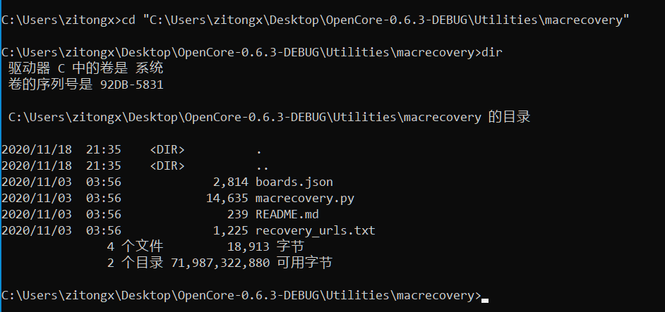
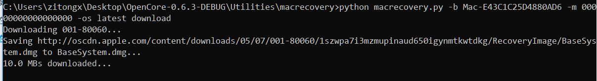
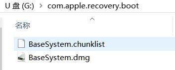
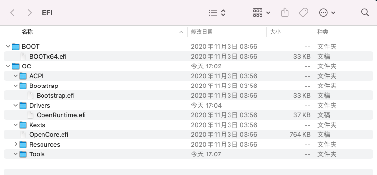
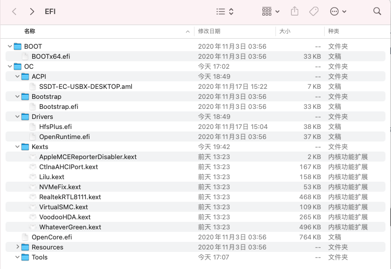
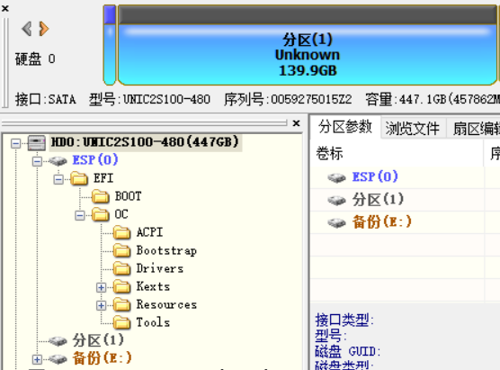

## HackAppleBigSur_msi_B450itx_2600
- 锐龙2600 + MSI B450itx + RX560 + BigSur11.0 + UEFI模式（非legacy）
- [AMD BIOS设置](https://dortania.github.io/OpenCore-Install-Guide/AMD/zen.html#amd-bios-settings)
- 专业教程请参考[OpenCore官网](https://dortania.github.io/OpenCore-Install-Guide/)
- icloud,imessage,facetime无法登陆账号使

### 0. 成功安装的两个要素
- MacOs镜像写入磁盘
- 自定义EFI欺骗操作系统以为是原生的MAC
&nbsp;

### 1. [创建安装U盘](https://dortania.github.io/OpenCore-Install-Guide/installer-guide/winblows-install.html#downloading-macos)

#### 1.1 恢复镜像下载

- 需要一个不小于4GB的u盘，16GB以上更好，可以直接写入完整镜像安装，本文不讨论这种模式。
- 下载[OpenCorePkg](https://github.com/acidanthera/OpenCorePkg/releases),本文下载的是OC v0.6.3 DEBUG版本
- 解压并打开下载好的OpenCore-0.6.3,逐级进入子目录`\OpenCore-0.6.3-DEBUG\Utilities\macrecovery`，然后复制该路径，目的是为了之后调用该目录下的`macrecovery.py`文件下载macos恢复镜像

- windows需要安装python，且python已经添加到环境变量中(cmd窗口中输入`python`不报错)
- 打开cmd窗口，进入到`macrecovery`文件夹下：`cd XXXXXX`

- 使用`macrecovery.py`下载恢复镜像，本文下载的是最近（截至2020-11-18）的BigSur系统,cmd下继续输入以下命令执行python脚本：
`python macrecovery.py -b Mac-E43C1C25D4880AD6 -m 00000000000000000 -os latest download`

- 恢复镜像会下载到`macrecovery`文件夹下
&nbsp;

#### 1.2 镜像拷贝到U盘
- 插入U盘，将其格式化成FAT32格式，所有系统都可以识别其文件
- U盘根目录新建文件名为`com.apple.recovery.boot`文件夹，将上一步中下载的`.dmg`镜像和chuanklist文件拷贝到文件夹中

- 将`\OpenCore-0.6.3-DEBUG\X64`（64位操作系统）目录下的`EFI`文件夹拷贝到U盘根目录

---
### 2. EFI文件配置
不同电脑由于硬件的不同需要配置不同的EFI文件，注意某些硬件可能不支持macos系统，例如三星PM981 NVME硬盘，具体信息请阅读[OpenCore硬件设置](https://dortania.github.io/OpenCore-Install-Guide/macos-limits.html)

#### 2.1 [初始文件配置](https://dortania.github.io/OpenCore-Install-Guide/installer-guide/opencore-efi.html)

删除u盘`efi`文件夹下的一些文件，得到如图所示的文件结构
- `Drivers`目录下只保留 `OpenRuntime.efi`
- `Tools`目录下所有文件均删除

#### 2.2 [添加符合自己机器硬件的驱动](https://dortania.github.io/OpenCore-Install-Guide/ktext.html#firmware-drivers)

- `Drivers`目录下只需要`OpenRuntime.efi`和[`HfsPlus.efi`](https://github.com/acidanthera/OcBinaryData/blob/master/Drivers/HfsPlus.efi)这两个驱动文件
- [`Kexts`](https://dortania.github.io/OpenCore-Install-Guide/ktext.html#kexts)目录下放置对应硬件的驱动文件，包活板载网卡、无线网卡、声卡、显卡等，因此可以下载鲁大师或者AIDA64查看自己的硬件型号
  - 必须：[`VirtualSMC`](https://github.com/acidanthera/VirtualSMC/releases),[`Lilu`](https://github.com/acidanthera/Lilu/releases)
  - GPU：推荐黑苹果免驱的[AMD显卡](https://dortania.github.io/OpenCore-Install-Guide/macos-limits.html#gpu-support)，但同时需要[`WhateverGreen`](https://github.com/acidanthera/WhateverGreen/releases),注意`rx580 2048sp`不适用黑苹果，必须重新刷入bios，比如`rx570`的bios。
  - 音频：[`AppleALC`](https://github.com/acidanthera/AppleALC/releases), AMD 锐龙CPU使用`VoodooHDA`驱动
  - [以太网](https://dortania.github.io/OpenCore-Install-Guide/ktext.html#ethernet)：根据链接下载自己有线网卡对应的驱动，msi b450itx对应[`RealtekRTL8111`](https://github.com/Mieze/RTL8111_driver_for_OS_X/releases)
  - USB:amd主板不需要
  - WI-FI和蓝牙：通常使用原生苹果拆机无线网卡，这样可以不用驱动直接使用，但由于最近疯狂涨价，所以没有配置，后期尝试使用intel无线网卡的驱动。
  - 其他：
    - [`AppleMCEReporterDisabler`](https://github.com/acidanthera/bugtracker/files/3703498/AppleMCEReporterDisabler.kext.zip)

    - [NVMeFix](https://github.com/acidanthera/NVMeFix/releases)修复nvme硬盘

    - [CtlnaAHCIPort](https://github.com/dortania/OpenCore-Install-Guide/blob/master/extra-files/CtlnaAHCIPort.kext.zip) 

- [`ACPI`目录](https://dortania.github.io/OpenCore-Install-Guide/ktext.html#ssdts): AMD b450主板只需要[`SSDT-PLUG`](https://dortania.github.io/Getting-Started-With-ACPI/Universal/plug.html)

配置好后的EFI目录如下所示：

#### 2.3 [修改config.plist文件](https://dortania.github.io/OpenCore-Install-Guide/AMD/zen.html#starting-point)
这部分十分重要，根据官方教程多看几遍，仔细修改参数，这里只简单介绍修改工具和amd kernel的替换。
- 将`\OpenCore-0.6.3-DEBUG\Docs\Sample.plist`拷贝到u盘`EFI\OC`目录下,重新命名为`config.plist`
- 下载[ProperTree](https://github.com/corpnewt/ProperTree)修改`config.plist`
- 以管理员运行`\ProperTree-master\ProperTree-master\ProperTree.bat`,点击`File\OPEN`(<kbd>Ctrl</kbd>+<kbd>O</kbd>),选择`config.plist`文件打开
- 之后选择`File\OC Clean Snapshot`(<kbd>Ctrl</kbd>+<kbd>Shift</kbd>+<kbd>R</kbd>)，选择`EFI\OC文件夹`,自动生成符合之前添加的驱动的`config.plist`文件
- 根据教程修改参数,以下只列出教程中需要重点修改的部分
  - `Booter/Quirks`
  - `DeviceProperties`
  - `Kernel`
    - `Emulate`
    - ==Patch==：这部分需要用 [AMD CPU适用的patch](https://github.com/AMD-OSX/AMD_Vanilla)来替换,下载整个项目，选择对应cpu 型号（Ryzen对应17th）下的`patches.plist`文件，用已下载的`ProperTree`打开，复制`Kernel/Patch`部分。删除`config.plist`文件中的`Kernel/Patch`,在Kernel目录下粘贴`patches.plist`中的`Patch`。
    - `Quirks`
  - `Misc`
    - `Debug`
    - `Security`
  - `NVRAM`
    - `7C436110-AB2A-4BBB-A880-FE41995C9F82`
      - ==boot-args==
  - `PlatformInfo`:[三码设置](https://dortania.github.io/OpenCore-Install-Guide/AMD/zen.html#platforminfo)

    - > you want to get a message back like: "Invalid Serial" or "Purchase Date not Validated"
    - MacPro 默认独显输出，因此需要有独显
    - iMac需要iGpu，但是我用iMac也没有问题
    - MacPro7,1 遇到开机内存插槽不符警告，可以忽略

----

### 3. 安装系统
- 注意安装磁盘格式化为GUID格式，分配一个EFI分区，用于系统成功安装后将u盘中EFI文件拷贝到磁盘EFI分区内
- 插入U盘，设置U盘为第一启动项，或者开机选择从U盘启动，进行OC引导界面，选择`install macos...`安装系统
- 成功安装MacOs后将配置好的EFI文件拷贝到预先分出的EFI分区下，如图所示：

- ~~这种方法需要电脑网卡正确配置，并且能够下载完整的BigSur系统，大约耗时1h左右。~~

### 4. to do
- [x] 更换release版本的oc引导
- 配置intel无线网卡驱动
- OpenCore GUI设置
- 尝试解决icloud登陆问题
- ~~根据配置修改机型，iMac似乎需要支持集显的机型，虽然目前使用没有毛病，但是还是修改成iMacPro比较好，MacPro7,1不知道是否支持Catalina。~~
- 提供完整镜像写入磁盘的安装方式
- 黑苹果支持读写NTFS格式磁盘

