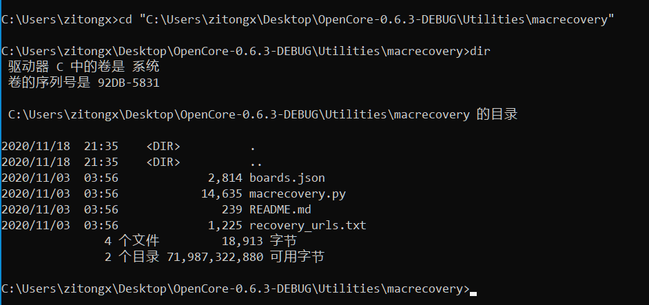
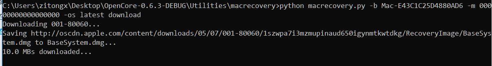
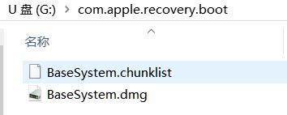

## 基于OpenCore的AMD黑苹果EFI配置总结【windows平台】
- 专业教程请参考[OpenCore官网](https://dortania.github.io/OpenCore-Install-Guide/)

### 成功安装的两个要素
- macos镜像写入磁盘
- 自定义EFI欺骗操作系统以为是原生的mac
&nbsp;

### [创建安装U盘](https://dortania.github.io/OpenCore-Install-Guide/installer-guide/winblows-install.html#downloading-macos)
- 恢复镜像下载
    - 需要一个不小于4GB的u盘，16GB以上更好，可以直接写入完整镜像安装，本文不讨论这种模式。
    - 下载[OpenCorePkg](https://github.com/acidanthera/OpenCorePkg/releases),本文下载的是OC v0.6.3 DEBUG版本
    - 解压并打开下载好的OpenCore-0.6.3,逐级进入子目录`\OpenCore-0.6.3-DEBUG\Utilities\macrecovery`，然后复制该路径，目的是为了之后调用该目录下的`macrecovery.py`文件下载macos恢复镜像

    - windows需要安装python，且python已经添加到环境变量中(cmd窗口中输入`python`不报错)
    - 打开cmd窗口，进入到`macrecovery`文件夹下：`cd XXXXXX`
    
    - 使用`macrecovery.py`下载恢复镜像，本文下载的是最近（截至2020-11-18）的BigSur系统,cmd下继续输入以下命令执行python脚本：
    `python macrecovery.py -b Mac-E43C1C25D4880AD6 -m 00000000000000000 -os latest download`
    
    - 恢复镜像会下载到`macrecovery`文件夹下
&nbsp;
- 镜像拷贝到U盘
    - 插入U盘，将其格式化成FAT32格式，所有系统都可以识别其文件
    - U盘根目录新建文件名为`com.apple.recovery.boot`文件夹，将上一步中下载的`.dmg`镜像和chuanklist文件拷贝到文件夹中
    
    - 将`\OpenCore-0.6.3-DEBUG\X64`（64位操作系统）目录下的`EFI`文件夹拷贝到U盘根目录
    

### EFI文件配置
    不同电脑由于硬件的不同需要配置不同的EFI文件，注意某些硬件可能不支持macos系统，例如三星PM981 NVME硬盘，具体信息请阅读[OpenCore硬件设置](https://dortania.github.io/OpenCore-Install-Guide/macos-limits.html)

- 基本文件处理
- 添加符合自己机器硬件的驱动
- 修改config.plist文件

### 已知Bug
- 键盘大写字母有时失灵
- icloud,imessage,facetime无法登陆apple id

### to do
- 配置intel无线网卡驱动
- OpenCore GUI设置
- 尝试解决icloud登陆问题,是否是无效三码问题